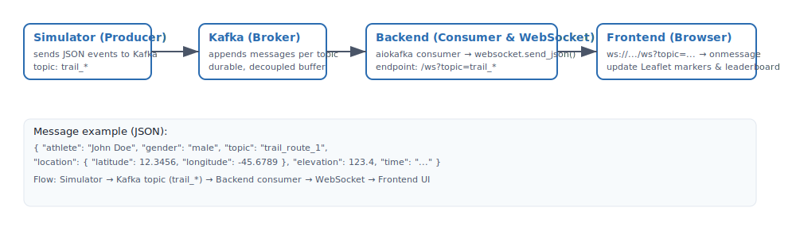

# Data flow diagram

Below is a visual diagram showing the end-to-end event flow: Simulator (producer) → Kafka → Backend (consumer & WebSocket) → Frontend (browser) → Map / Leaderboard.



The SVG is stored next to this file in `docs/flow.svg` so it renders directly on GitHub and scales cleanly (useful instead of a raster PNG).

If you prefer a PNG export (for some platforms), you can export the SVG to PNG locally with a tool like ImageMagick or `rsvg-convert`:

```powershell
# Convert SVG to PNG (example using ImageMagick on Windows)
magick convert docs/flow.svg docs/flow.png

# Or using rsvg-convert
rsvg-convert docs/flow.svg -o docs/flow.png
```


Short summary

- Simulator publishes JSON events to Kafka topics named `trail_*` (topic names are the simulator's `BASE_TOPIC_PREFIX` + trail name).
- Backend consumes Kafka topics and forwards events via a WebSocket endpoint: `/ws?topic=<topic>`.
- Frontend opens the WebSocket, receives JSON messages and updates Leaflet markers and a leaderboard computed against the GPX route.

Message example

```json
{
  "athlete": "John Doe",
  "gender": "male",
  "topic": "trail_route_1",
  "location": { "latitude": 12.3456, "longitude": -45.6789 },
  "elevation": 123.45,
  "time": "2025-11-12T12:34:56Z",
  "event": "running"
}
```
